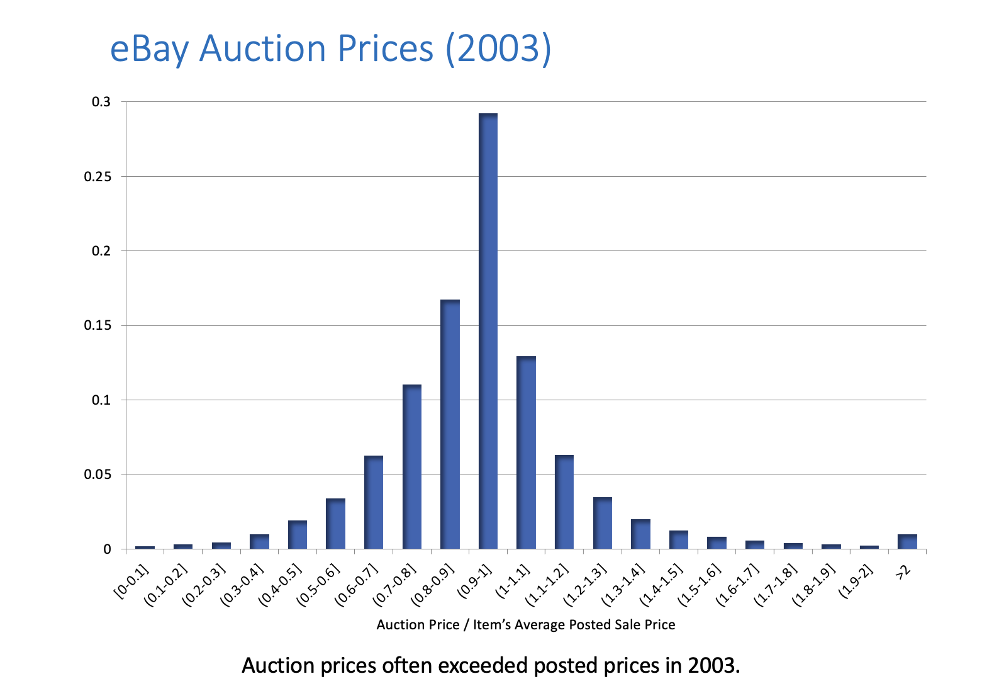
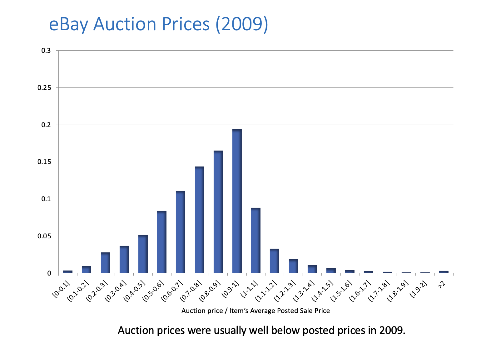

# Auction Theory

## Single Item Auctions

A seller has a single item that she wants to sell. How can she identify the right buyer and price? Why use an auction instead of s1. ply setting a price? The seller may not know what price to set, and guessing can lead to problems: too high, no sale; too low, excess demand. Potential buyers know their max prices but don't always reveal them (everyone loves a good deal!). If **acceptance** of any offer is **deferred** until all offers can be compared, then the mechanism is called an **auction** and leads to **competition** and **price discover**.

```{epigraph}
Auctions are games that guide prices to mimic markets.
-- Josh Gross
```

We can model this with $N$ bidders. The item is worht $v_n > 0$ to bidder $n$ (if $v_n \leq 0$ then they don't join the auction). Losing bidders have payoffs of zero. The winning bidder pays $p$ has payoff $v_n - p$.

## Sealed-Bid Auctions

```{index} sealed-bid auctions
```

A sealed bid auctions (also called "blind auctions") are auctions where bidders submit bids secretly and simultaneously, so no one knows the bid of anyone else. The highest bid always wins, but they don't always pay the highest price for reasons we'll explore later.

```{glossary}
first-price auction
    * Each bidder privately writes down a number
    * The highest number wins (ties broken arbitrarily)
    * The winning bidders pays a price equal to **her bid**
    * *Each bidder should bid **less than the maximum** they're willing to pay*

second-price auction
    * Each bidder privately writes down a number
    * The highest number is the winning bid (ties broken arbitrarily)
    * The winning bidder pays a price equal to the highest losing bid
    * Second-price auctions are truthful: each bidder should bid exactly the maximum it is willing to pay

universal best reply
    The action $\bar{a}_n$ is a _universal best reply_ for player $n$ if for _all_ $a_{-n} \in A_n$, we have $\bar{a}_n \in \text{argmax}_{s_n} u_n(a_n, a_{-n})$
````

```{prf:remark}
:label: dom-strat
The strategy $\bar{a}_n$ is a **dominant strategy** if it's the unique universal best reply.
```

## Truthful Mechanisms


```{glossary}
truthful (auction)
    An auction is **truthful** if each player $n$ has a universal best reply, which is to report its true value $v_n$ to the auctioneer.
```

```{prf:proposition}
The second-price auction is truthful.
```

```{prf:proposition}
The second-price auction is the _only_ auction for this setting that has these three properties:
1. Truthfulness: the auction is always truthful
2. efficiency: the highest bid always wins
3. losing bidders pay nothing
```
We provide a sketch of the prooof. The details are left as an excercise.
```{prf:proof}
Sketch:
1. Truthful incentives $\Rightarrow$ given others' bid, all of $n$'s winning bids must always lead to the same price $p(v_{-n})$. 

2. Truthful incentives + Losers pay zero $\Rightarrow$ $n$ wins when its reported value exceeds $p(v_{-n})$.

3. Efficiency $\Rightarrow$ $n$ wins when its reported value exceeds the highest opposing value $\max_{m\neq n}v_m$.

4. From 2. and 3., we get $p(v_{-n}) = \max_{m\neq n}v_m$.
```

## Vickrey-Clark-Groves (VCG) Mechanisms

```{index} Vickrey-Clark-Groves (VCG) Mechanisms
```

Consider an abstract setting in which our “system” must choose one from a finite set of outcomes.

Examples:

* How many items to assign to each bidder (from a set of identical items)?
* Who wins which from a set of distinct items? 
* Which room in a rental house should be assigned to each roommate?
* Whether to build a children’s playground at the apartment complex and how to equip it?  
* Building a bridge: whether to do it, where and which kind?

The people are $n=1,\dots,N$ and the possible decisions are numbered $k=1,\dots,K$. Person $n$ has value $v_{nk}$ for decision $k$. Notation: $v_n=(v_{n1},\dots,v_{nK})$, $v=(v_1,\dots,v_N)$. The system collects value reports and uses those to select a value-maximizing decision $k^{*}$: $k^* \in \arg\max_k v_{1k}+\dots+v_{Nk}$. But agents could misreport their values. Is there any way to incentivize truthful value reports? How?

Some Ideas:

* A “direct mechanism” asks each player to report values for each possible decision. 
* The system then uses the reports to choose the decision $k^*$ that maximizes the total welfare and makes a payment (positive or negative) to each player.
* So… each player can, by exaggerating her report, cause the system to select any decision. Why would she report truthfully? 
* Solution: arrange the payments to players to align each player’s interest with the total welfare.  
* Given any reports by others, any two reports by a single agent $n$ that lead to the same decision $k$ must lead her to receive the same payment, which we denote by $p_n(k,v_{(-n)})$.

```{prf:algorithm} Vickrey-Clark-Groves (VCG) Mechanism
:label: vcg-mechanism
1. Each player $n$ reports values $v_n\in\mathbb{R}^K$
2. The system uses reported values to select $k^(v):\ k^*(v)\in\arg\max_{k}\sum_{j=1}^N v_{jk}$
3. If $k^*(v)=k$, we pay player $n$:
\begin{align*}
p_n(k,v_{-n})&=\sum_{j\neq n} v_{j,k} + f_n(v_{-n})
\end{align*}
4. Then $n$’s payoff is
\begin{align*}
$v_{nk}+p_n(k,v_{-n})=v_{nk}+\sum_{j\neq n} v_{jk} + f_n(v_{-n})$
\end{align*}
```

```{prf:theorem} VCG is Truthful
:label: vcg-truthful
Theorem
1. Every VCG mechanism is truthful and selects a decision in $k^*(v)$.
2. Every mechanism that is truthful and selects a decision in $k^*(v)$ is a VCG mechanism.
```

```{prf:proof}

(Part 1) We must show that $n$'s payoff from reporting $v_n$ truthfully minus her payoff from making any other report $\hat{v}n$ is always non-negative. Truthful reporting leads to an outcome $k\in k^*(v_n,v{-n})$. Any other report of $\hat{v}_n$ leads to an outcome $\hat{k}\in k^*(\hat{v}_n,v_{-n})$, so the payoff difference is:

\begin{align*}
& \left(v_{nk}+p_{n}\left(k,\ v_{-n}\right)\right)-\left(v_{n\hat{k}}+p_{n}\left(\hat{k},v_{-n}\right)\right) \\
&=\left(v_{nk}+\sum_{j \neq n}^{ }v_{jk}+f_{n}\left(v_{-n}\right)\right)-\left(v_{n\hat{k}}+\sum_{j \neq n}^{ }v_{j\hat{k}}+f\left(v_{-n} \right)\right) \\
&\ge0
\end{align*}

The $f_n(v_{-n})$ terms cancel one another. The remaining difference is non-negative because $k\in k^*(v_n,v_{-n})$ maximizes total welfare.

(Part 2) By construction, for any non-VCG payment rule, there is some ${v_{-n}}$ such that participant $n$’s total payoff ${v_{nk}+p_n(k,v_{-n})}$ is misaligned with the total welfare, say by favoring some $\hat{k}$ over ${k'}$ by a positive amount ${2\delta>0}$.

When ${v_n}$ is such that, given ${v_{-n}}$, the total welfare is ${\delta}$ higher for ${k'}$ than $\hat{k}$, $n$ will still favor outcome ${\hat{k}}$ and its associated payment by ${\delta}$. By reporting a ${\hat{v}_n}$ according to which $\hat{k}$ is uniquely valuable, $n$ can manipulate the mechanism to select outcome ${\hat{k}}$, which she favors: truthful reporting fails to maximize $n$’s payoff.

Suppose that prices $p$ are not VCG, then there exists $n, \hat{k}, k', v_{-n}$ such that
\begin{align*}
0\le2\delta \stackrel{\text{def}}{=} \left(\sum_{j \neq n}^{ }v_{jk'}-p_{n}\left(k',\ v_{-n}\right)\right)-\left(\sum_{j \neq n}^{ }v_{j\hat{k}}-p_{n}\left(\hat{k},v_{-n}\right)\right)
\end{align*}

Let $v_n$ be as follows:

\begin{equation*}
v_{nk}=\begin{cases}
        0 \quad &\text{if} \, k \in \{k', k\} \\
        \text{large} \quad &\text{if} \, k = k' \\
        v_{nk'} + \delta \quad &\text{if} \, k = \hat{k} \\
     \end{cases}
\end{equation*}

One can verify that $k' \in k^{*}(v)$ and that $v_{n{hat{k}}} + p_n(\hat{k}, v_{-n}) > v_{nk'} + p_n(k', v_{-n})$. These imply that truthful reporting leads to outcome $k'$ but, given the prices, $n$ prefers outcome $k'$. Outcome $\hat{k}$ results if $n$ reports some $\hat{v}_{n}\neq v_n$ with $\hat{v}_{n\hat{k}}$ sufficiently high and $\hat{v}_{nk} = 0$ for $k \neq \hat{k}$. Hence, without VCG prices, the mechanism that selects $k' \in k^{*}(v)$ is not truthful. 
```

## Revenues

```{glossary}
sealed bidding
    Seller asks for single round of sealed bids. The highest bidder wins and pays its bid.

    Common in selling real estate, timber,commodities, construction or service contracts (where “low bid” wins!). It is also possible to use a second-price auction.  

ascending auction
    Price starts low, bidders (or auctioneer) raise price until only one bidder is left.

    Common for art, antiques, cars, charity auctions, livestock, real estate, company “take-overs”, job market (if you’re lucky!).
    
    Variant: price starts high and slowly drops until someone buys – used in Dutch flower auctions, “clearance” sales.
```

### Canonical Model

Potential Buyers:

* $N$ bidders with values $v_1, v_2, \dots, v_N$
* Values $v_j$ drawn are independently from uniform distribution on $[0, 100]$.
* Each buyer's value is his own private information.

Seller gets to set the auction rules.

```{note}
Same ideas apply with values drawn from a distribution other than $U[0, 100]$, but uniform makes arithmetic easy.
```

## Ascending Auction
```{index} ascending auctions
```
```{prf:algorithm} Ascending Auction
:label: ascending-auction
1. Price starts at zero, and rises gradually and continuously.
2. Buyers indicate their willingness to continue bidding (e.g. keep their hand up) or can exit.
3. Auction ends when just one bidder remains.

Final bidder wins, and pays the price at which the second-to-last bidder dropped out.
```

### Strategy
```{prf:remark} Ascending Auctions are Truthful
Ascending auctions are truthful. Bidding until the price just equals your value is optimal regardless of others’ bids.
```

### Outcome
Outcome
* Bidder with highest value will win.
* Winner will pay second highest value.

```{prf:example}
Consider three bidders whose values are 25, 33, and 75. First exits at 25, second at 33 and auction ends.
```
### Revenue
What average revenue can we expect from the ascending auction? (Assume two bidders with values 𝑈[0,100]).
* Revenue will be equal to the second highest value.
* Expected revenue is equal to the expected second highest value.

If we repeatedly draw two values from $U[0,100]$,
* On average, the highest draw will be 66 2/3.
* On average, the second highest will be 33 1/3, which is also the average (or expected) revenue.  

Questions: how would expected revenue be different if:
* there were three bidders? 
* values were drawn from $U[0,200]$? 
* values were drawn from $U[100,200]$?

### Competition

How are "gains" divided?
```{prf:example}
Two bidders with values $U[0,100]$:
* Expected value of winner: $66 \frac{2}{3}$.
* Expected price: $33 \frac{1}{3}$.
* Expected consumer surplus: $33 \frac{1}{3} = 66 \frac{2}{3} - 33 \frac{1}{3}$.

If seller has zero value, equal split of price, consumer surplus.

With three bidders, expected value of winner: $75$ and expected price: $50$.

With more demand, expected value creation is higher and seller can capture a higher price (and price/value?).

With $10$ bidders, mean value of winner is $64 \frac{10}{11}$, mean price is $64 \frac{9}{11}$ of $100$.
```

## Second-Price Auctions

In equilibrium, it is a dominant strategy to bid truthfully. If all do that, then:
* Bidder with highest value wins.
* Pays an amount equal to second highest value.
* Exactly the same as the ascending auction!
* Same winner, same price/revenue.

```{prf:example}
Three bidders with values 25, 33, 75. Winner has value 75, pays 33, as in ascending auction.
```

## First-Price Auctions

Bidders submit sealed bids. Bidder who submitted highest bid wins. Winning bidder pays his own bid.

How should we expect participants to bid?
* Best to submit a bid less than your true value.

How much less? 
* Submitting a higher bid increases the chance you will win, but also the amount you'll pay if you do win.

No dominant strategy: Optimal bid depends on what you think the others will bid (unlike in the second-price auction!).

We will use Nash equilibrium analysis.

## Nash Equilibrium 

```{glossary}
(Bayesian) Nash equilibrium
    A set of bidding strategies is a (Bayesian) Nash equilibrium if each bidder’s strategy maximizes his expected payoff given the strategies of the others.
```

In an auction game, a strategy says how much you should bid for every possible value. Bidders do not know their opponent’s values, i.e. there is “incomplete information.” So each bidder’s equilibrium strategy must maximize her expected payoff accounting for the uncertainty about the opponents’ values.

### Finding the Equilibrium

Suppose 2 uses the strategy $b_2 = \beta v_2$. Bidder 1 understands 2’s strategy (the equilibrium assumption), but doesn’t know 2’s bid because he doesn’t know $v_2$. If bidder 1 bids $b$, then we win and pay $b$ if their opponent bids less than $b$. Otherwise, the opponent bids in $(b, 100)$ and wins. If we draw $x$ uniformaly from $(0, 100)$, then $P(v_2 < x) = x / 100 = 0.01x$.

| Event | Probability | Payoff |
|-------|-------------|--------|
| $b_2 < b$ | $P(\beta v_2 < b) = P(v_2 < b / \beta)  = 0.01 b / \beta$ | $v_1 - b$ |
| $b_2 > b$ | $P(\beta v_2 > b) = 1 - (0.01 b) / \beta$ | $0$ |

Expected profit is $0.01 b / \beta (v_1 - b) + (1 - (0.01b) / \beta) 0$. Bidder 1's bidding problem is to maximize expected profit $\max_{b \leq 100 \beta} 0.01 b / \beta (v_1 - b)$. Since scaling doesn't effect the optimal bid, we can simply this as $\max_{b \leq 100 \beta} b  (v_1 - b)$. Our first order condition for an interior optimum is $(v_1 - b) - b = 0$. Rearranging, we get $b^{*} = v_1 / 2$ If bidder 2 uses the strategy $b = \beta v_2$, bidder 1's _best response_ is to use the strategy $b_1 = \min(v_1 / 2, 100 \beta)$. There is a Bayes-Nash equilibrium of the first-price auction with $b_1 = v_1 / 2, b_2 = v_2 / 2$. The bidder with the highest value wins in equilbrium. 

```{admonition} Question
What is the revenue on average?
```

```{dropdown} Solution
Values are distributed on $U[0, 100]$, so bids are distributred $U[0, 50]$. High value, on average is $66.\bar{6}$ and high bid on average is $33.\bar{3}$.
```

Exactly the same as the ascending and second price! Same for each realization of bidder values, or just on average?
Example: suppose bidder values are 75 and 50. What then?

### Recap
We compared two sealed bid auctions:
* High bidder wins and pays own bid
* High bidder wins and pays next-highest bid.
Result: on average the seller gets the same revenue.

```{important}
Why don’t you get more by charging the winner his own bid, rather than a lower amount?
```

When you change the game, you also change behavior! The equilibrium strategy goes from $b = v$ to $b = v / 2$. What is most surprising is that the change in behavior just exactly offsets the change in the rules!

## Revenue Equivalence Theorem

We’ve seen that several standard auctions share the following properties if bidders play according to Nash equilibrium:
* The high value bidder wins.
* The expected auction price equals the expected value of the second highest bidder.

```{prf:theorem} Revenue Equivalence Theorem
:label: rev-equiv
"Efficient" auctions (where the high value bidder wins) are "revenue equivalent" (yeild _exactly_ the same price on average).
```

The theorem is more general then our two examples, and has been mentioned in the citations of two Nobel Prizes: William Vickrey in 1996 for the first version of the result, and Roger Myerson in 2007 for using a generalization of it to describe “optimal” auctions. 

## Other Auctions

```{glossary}
Descending price (Dutch) auction
    * Price starts high, drops continuously until someone buys. 
    * Strategically “equivalent” to a first price auction.

“All pay” auction
    * Bidders submit bids, high bidder wins, and everyone has to pay their bid. 
    * Not commonly seen, but sometimes used as a stylized model of animal competition, political lobbying donations, or contests where money is spent to win.

“Penny auctions”
    * Ascending auction, with the twist that you pay for every bid along the way (e.g. DealDash).
```

## Elements of Auction Design

Sellers have a variety of ways to modify the basic auction forms and try to increase their revenue or achieve other objectives.
1. Attract more bidders to participate in the auction.
2. Set a reserve price (or “minimum bid).
3. Subsidize weak bidders to create competition.
4. In many settings, there is also the challenge of making sure bidders don’t collude.

## Auction Design in Practice

### Are Bidders _Really_ Strategic?

Game theory models we’ve looked at assume that bidders understand the environment and behave strategically, but is this a good assumption? In practice, it depends. Lots of evidence against the assumption when looking at bidders in novel environments with little feedback. But potentially a reasonable assumption for experienced and sophisticated bidders in familiar environments.

```{prf:example}

{cite:t}`10.2307/29783689`
* Auctions for a game “Cashflow 101” – in 2004.
* Available from two eBay sellers at posted price: $129.95.
* Price went higher in 42% of the auctions!

{cite:t}`10.2307/24466994`
* Hundreds of thousands of cases where an eBay seller sold a product by auction while also selling it at a posted price.
* Auction prices exceed posted prices fairly often in 2003, but by 2009 in relatively few auctions, and usually by just a few dollars.
```

| 2003 | 2009 |
| - | - |
|  |  |

## Summary

Why Auctions?
* Auctions can be especially useful when the demand is unknown and supply is limited.
Truthful Mechanisms
* The VCG mechanisms are truthful. They are the only truthful and efficient mechanisms for a certain wide class of problems.
Revenue Equivalence
* In a certain class of models, all auction mechanisms in which the highest bidder always wins lead to the same average price.
Evidence: Real bidders are often (but not always) strategic.