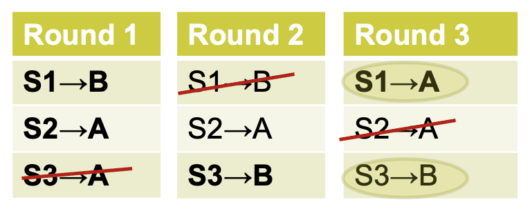
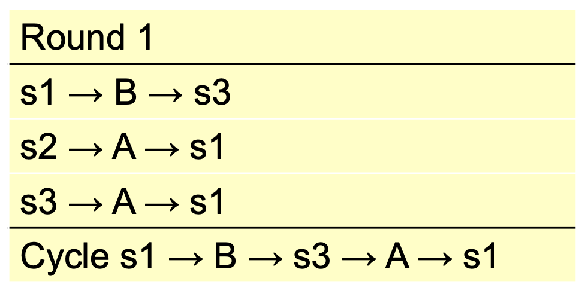
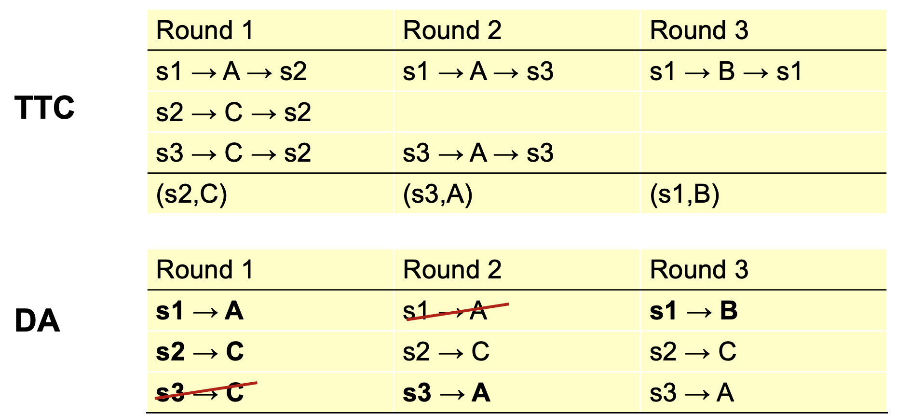

# School Choice

```{figure} ../images/school-choice.png
:name: school-choice
:height: 400px

_Wanderer above the Sea of Fog_ by Caspar David Friedrich inpainted with an aerial view of Stanford's campus with DALL-E-2.
```

So far, two approaches to matching problems

* Finding stable outcomes: DA algorithm
* Finding core or Pareto efficient outcomes: serial dictatorship, TTC and Priority Line mechanisms.
  
And applications: entry-level labor markets (residents, law clerks), room/house allocation, kidney exchanges.

Today: applying matching theory to school choice

* Common problem, with interesting open questions.
* Useful to illustrate trade-offs between different objectives (stability vs. efficient) and different mechanisms (DA vs TTC).

In many countries including the US, children historically have gone to neighborhood schools. In more recent years, many US cities have adopted “school choice” programs, designed to give families additional flexibility, and maybe create some competition between schools. We’ll discuss how the matching mechanisms we’ve studied inform the design of these programs.

## Objectives

What are the design goals?  

1. “Efficient” placements
2. “Fair” procedure and outcomes
3. Mechanisms that are easy to understand and use.
4. Promote quality-enhancing competition among schools (?)

{cite:t}`10.2307/3132114` argued that placement mechanisms used in many cities are badly flawed and proposed alternative mechanisms. In the following years, gradually, many cities, eg. Boston, New York, Chicago, San Francisco, adopted new mechanisms. A flurry of research soon followed and still continues

* Designing improved mechanisms & studying the performance of mechanisms in use.
* Partially random nature of allocations allows causal empirical studies of school effectiveness.

## School Choice Model

Set of students $S$ and schools $C$

* Each student can go to one school
* Each school $c$ can admit $q_c$ students
* Each student has strict preferences over schools.
* Each school has a strict “priority order” over students.

This is a “many-to-one” version of the matching model we started with.

## Stability

One notion of a “good” assignment might be an assignment that is stable.

Stability means:
: no blocking individual – no student wants to drop out and no school wants to refuse a student.
: no blocking pair – no student can find a school that will accept her, possibly by displacing some other student.

## Stability as Fairness

No blocking individual means no student can be forced to attend a school they don’t want to attend, and no school can be forced to take a student they view as unqualified. No blocking pair can mean “no justified envy.” That is, no student $s$ prefers school $c$ to her assigned school $c$, when some other student with lower priority is assigned to $c$.

## Boston Mechanism

```{prf:algorithm} Old Boston Mechanism
:label: boston-mech
Each student submits a preference ranking, and each school’s priority order over students is known.
1. Consider the top choices of the students
2. For each school, assign seats to students that ranked it first according to priority order. 
3. Stop if all seats assigned or run out of students ranking it first.
4. Consider remaining students and their second choices. Repeat the above process.
5. Continue with third choices and so on $\ldots$
```

### Problems

```{prf:remark}
The Boston mechanism is not strategy-proof.
```

If you don’t put your priority school high on your rank list, you may lose it!

```{prf:example}
You want school $A$ most and $B$ second. You have high priority at $B$ but not $A$. If a school is in high demand, then to be admitted you need both to rank it first and have high priority. Perhaps you should rank $B$ first.
```

This was well-understood by Boston parents, and frequently showed up on parent message boards.

```{prf:remark}
The Boston mechanism is also unfair.
```

Doesn't necessarily lead to stable outcomes.

```{prf:example}
Consider the situation on the prior slide and suppose the family decides to take a risk, puts $A$ first, and then ends up at much less preferred school $C$. The outcome is not stable because the family has high priority at $B$ and prefers it to $C$. There is “justified envy.”  Or, it ranks $B$ first and later learns that it could have gotten into $A$! (Economically) disadvantaged families often don’t know how to game the system.
```

### Boston in Practice

Students entering in grades K,6,9 and new students submit preferences
Schools have priorities as follows:

1. Students already at the school.
2. Students with a sibling at the school and in the walk zone
3. Students with a sibling at the school but not in the walk zone
4. Students in the walk zone
5. Everyone else

{cite:t}`RePEc:boc:bocoec:639` found that 19% listed two over-demanded schools as top two choices and about a quarter of these students ended up unassigned – ugh!

## Columbus (OH) Schools

```{prf:algorithm} Columbus Mechanism
:label: columbus-mech
1. Each student applies to up to three schools.
2. For some schools, seats are guaranteed based on assignment area.
3. Once those are filled, a lottery is held at each school and offers are made. 
4. A student with an offer has three days to decide. If she says yes, she’s removed from the system.
5. Process repeats. 
```

## (Old) NYC Schools

```{prf:algorithm} Old NYC Mechanism
:label: old-nyc-mech
1. Each student (90,000 plus applying to high schools) can submit up to five applications.
2. Each school receives applications and makes offers, plus it makes a waiting list.
3. Students accept or reject offers.
4. Schools make offers from wait lists (three rounds)
```

Roughly 30,000 students would be unassigned at the end; they would be administratively assigned.

## Student Proposing DA

What about the student proposing DA?

* We know this leads to a stable match: no justified envy.
* And the stable match that is best for all the students, whose welfare we care about.
* Plus it’s strategy-proof for the students, and we may not be worried about schools if priorities are clearly stated.
So our earlier results indicate that student-proposing DA has attractive properties, but are there drawbacks?

```{prf:remark}
:label: ineff-stable
Stable Matches can be inefficient.
```

### Question

Consider students $s_1$, $s_2$, $s_3$, and schools $A$, $B$ with preferences:

\begin{align*}
    &s_1: B \succ A &A: s_1 \succ s_2 \succ s_3 \\
    &s_2: A &B: s_3 \succ s_1 \\
    &s_3: A \succ B \\
\end{align*}

Each school has one slot. Show that stable match does not imply Pareto efficient match for the students.

```{dropdown} Solution

Student-Proposing DAA:



Student-proposing DA yields $\{(s_1,A), (s_2, s_2), (s_3,B)\}$, but students prefer $\{(s_1,B), (s_2, s_2), (s_3, A)\}$ even though it isn't stable.
```

## Stability and Efficiency

A stable match, even a student-optimal stable match, may not be Pareto efficient: some students may prefer to trade positions.

```{admonition} Questions
1. If we want to find an assignment that’s Pareto efficient for students, how could we do it?
2. If we find an assignment that’s Pareto efficient for students, will it necessarily be stable?
```

## TTC for School Choice

Schools are different from houses because

* A school has multiple positions not just one
* A student can have priority at multiple schools.

Still, we can adapt TTC to this setting. {cite:t}`10.2307/3132114` explain how.

```{prf:algorithm} Adapted TTC
:label: adapted-ttc
1. Each student points to her top-ranked school among those still with open seats
2. Each school points to its top-priority student
3. Cycles are identified and removed: that is, any matched student is assigned and removed and the school to which she is assigned has its quota reduced by one seat.
4. Point again and repeat the process.
```

TTC effectively allows students (those in a cycle) to “trade” priorities.

### Questions

Find a student Pareto efficient match TTC for the previous question.

```{dropdown} Solution


Observe that the TTC assignment $\{(s_1,B), (s_2, s_2), (s_3, A)\}$ is *NOT STABLE*.
```

Now, consider the following preferences:
\begin{align*}
&s_1:  A  \succ  B  \succ  C &  A: s_2  \succ  s_3  \succ  s_1 \\
&s_2:  C  \succ  B  \succ  A & B: s_2  \succ  s_3  \succ  s_1 \\
&s_3:  C  \succ  A  \succ  B & C: s_2  \succ  s_1  \succ  s_3
\end{align*}

Run TTC to find a matching (schools have one slot each). How does this compare to using DA to find matching?

```{dropdown} Solution


Here TTC and Student DA both yield $\{(s_1,B),(s_2,C),(s_3,A)\}$.
```

### Properties

```{prf:theorem} TTC is Strategy-Proof
:label: ttc-strat-proof
TTC is strategy-proof and its outcome is efficient. 
```

```{prf:proof}
Proof is just like the housing problem: strategy-proofness is the same. Efficiency is the same as unblocked by the coalition of all agents. 
```

## Reforms

### Boston Reformation

{cite:t}`10.2307/4132849` describe the reform of the Boston school match.
They proposed either student-proposing DA or TTC; the school system chose DA in 2006.
School board didn’t like the TTC idea of “trading priorities” and worried about “justified envy.”

### NYC Reformation

{cite:t}`10.1257/aer.99.5.1954` describe reform:

* NYC is big: 90,000 students enter high school each year!
* NYC schools do not have fixed priorities – and under the old system they were strategic in reporting preferences.
* NYC decided to adopt a limited student-proposing DA.

Outcome: in first year of new program

* More than 70,000 got one of their choice schools.
* Another 7,600 got a choice school in follow-up RSD stage
* Just 3,000 were left, down from 30,000.

## Practical Issues

### Lotteries

School priorities often are coarse. In Boston, five categories: (1) at the school, (2) sibling + walk zone, (3) sibling, (4) walk zone, (5) other. Use lottery to generate priority order to run DA/TTC – either separate for each school, or common for all.

Consequence is that assignment partially random. Some view as arbitrary and unfair. Research consequence: lotteries allow evaluation of school effectiveness: compare subsequent performance of students who “lotteried in” or “lotteried out” of some charter school or other popular school. A (partially) randomized experiment!

### Information

School choice is premised on families making good decisions about how to rank schools. How informed are families? {cite:t}`10.2307/40506212` evaluated choices in Charleston, SC. Low-income families were very likely to choose local school; high-income families were more responsive to school test scores. Experiment showed that disseminating information about school quality had big impact on family rankings.

```{important}
A key part of market design is helping participants make good decisions.
```
